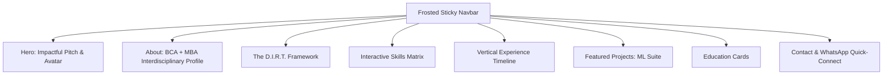

# Portfolio Website - Implementation Plan

This artifact outlines the architecture, design system, and content plan for the professional portfolio website of **Dandothkar Manik Prabhu**, Inside Sales Manager and AI Automation Expert.

---

## 🎨 Design & Aesthetic System
To create a "wow" factor, the website will use a high-end, responsive dark theme with sleek glassmorphism, glowing micro-interactions, and professional font hierarchies.

### Color Palette (Modern HSL)
- **Background Main**: `hsl(224, 71%, 4%)` (Deep Space Dark Navy)
- **Background Card/Glass**: `rgba(15, 23, 42, 0.45)` with `backdrop-filter: blur(16px)`
- **Primary Accent**: `hsl(190, 100%, 50%)` (Electric Neon Cyan)
- **Secondary Accent**: `hsl(263, 90%, 51%)` (Cyber Purple)
- **Text Primary**: `hsl(210, 40%, 98%)` (High-contrast Ice White)
- **Text Secondary**: `hsl(215, 20%, 65%)` (Cool Gray)
- **Success Glow**: `hsl(142, 70%, 50%)` (WhatsApp Green for Call-to-Action)

### Typography
- **Headings**: `Outfit`, Google Fonts (futuristic, clean, bold letterforms)
- **Body & Controls**: `Inter`, Google Fonts (exceptional readability and modern tech aesthetic)

### Motion & Micro-Animations
- **Hover Transitions**: `all 0.3s cubic-bezier(0.4, 0, 0.2, 1)`
- **Typing Animation**: JS-driven typewriter effect for the hero titles.
- **Scroll reveal**: Intersection Observer API for sections fading and sliding into place.
- **Floating particles / Glow bubbles**: CSS-only background glow animations.

---

## 🏗️ Structure & Page Sections

### 1. Header (Navbar)
- Sticky nav with glassmorphic blur.
- Custom logo combining initials **DMP** in a futuristic SVG layout.
- Smooth-scroll links: `About`, `Methodology`, `Skills`, `Experience`, `Projects`, `Contact`.
- Dynamic button: "Get in Touch" styled with electric cyan border-glow.

### 2. Hero Section (First Impression)
- **Left Column**:
  - Greet with dynamic titles using Typewriter JS: "Senior Inside Sales Manager", "Technical Automator", "AI Integrator", "Vibe Coder".
  - Tagline: *"Bridging the gap between B2B sales strategy and technical execution through AI workflows, intelligent automation, and multi-agent systems."*
  - CTAs:
    - **"Chat on WhatsApp"** (Primary, pulsing green-glow button, direct link to `wa.me/919666471196` with pre-filled recruiter template).
    - **"View Projects"** (Secondary, glassmorphic button).
- **Right Column**:
  - Glowing decorative frame containing the generated tech avatar `manik_avatar.png`.

### 3. The D.I.R.T. Framework
*Frame his background by sifting through 'data/draft' into a proprietary corporate framework.*
- **D**ata Acquisition (Zoominfo, Lead Extraction, Advanced research)
- **I**ntegrity & Validation (High-precision B2B lists, data cleaning)
- **R**esearch-backed Outreach (LinkedIn InMail, Cold Calling, email cadences)
- **T**echnological Automation (N8N workflows, Python scripts, LLM prompt engineering, Vibe Coding)

### 4. Interactive Skills Matrix
Interactive category pills that filter/highlight skill cards:
- **Sales Tech**: Zoominfo, Cold Calling, LinkedIn InMail, Consultative B2B Sales, Team Management.
- **AI & Automation**: N8N, LLMs, MCP, Machine Learning, Multi-Agent Orchestration.
- **Programming & Data**: Python, Advanced Excel, Basic SQL & NoSQL, Vibe Coding, Developer Logs.
- **Cloud & Infrastructure**: AWS Foundations, Microsoft Azure Foundations.

### 5. Work Experience (Visual Timeline)
- **CompQsoft Digital** (10/2024 - Present) | *Senior Inside Sales Manager*
  - Emphasize leadership of 4 associates, technical mentorship, B2B campaigns, and high-integrity lead pipelines.
- **Funnl** (04/2021 - 10/2024) | *Team Lead*
  - Emphasize managing 6–7 members, generating 3–4 high-quality leads daily, and standardizing data workflows.

### 6. Featured Projects (Glass Cards)
- **ML Suite** (Interactive card)
  - Visual display of the project using `ml_suite_project.png`.
  - Core features list: ML lifecycle automation, visual charting, hyperparameter tuning, granular developer logging.
  - Interactive links: "View Source on GitHub" and a customized "Live Demo" placeholder.

### 7. Education & Certifications
- **Malla Reddy College of Engineering and Technology** (MBA - Marketing, 2019-2021)
- **Sardar Patel Degree College** (BCA - Bachelor of Computer Application, 2016-2019)

### 8. Contact & Instant WhatsApp Recruiter Portal
- Floating icons for Email, LinkedIn, and GitHub.
- Premium direct contact form with feedback tooltips.
- **Special Recruiter Card**: *"Are you a recruiter? Click here to immediately message me on WhatsApp for a fast-tracked interview response!"*

---

## 🛠️ Tech Stack & File Manifest
All code is located in the local workspace directory `c:\Users\manik\Downloads\Portfolio Website`.
1. **`index.html`**: Semantic structure, integrated SEO meta tags, SVG icons, and Google Fonts links.
2. **`style.css`**: CSS Custom Variables for the token design system, keyframes for animations, frosted glass, responsive media queries.
3. **`script.js`**: Interactive dynamic scroll reveals, skill filter animations, dynamic typewriter text, and WhatsApp dynamic link builder.
4. **`manik_avatar.png`**: Premium high-tech vector avatar.
5. **`ml_suite_project.png`**: Premium ML SaaS dashboard visualization.

Let's begin implementation immediately by creating the CSS file!
